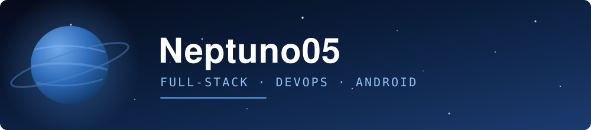

  

---

## Sobre mí

- Desarrolladora full-stack y DevOps.
- Trabajo con apps Android en **Kotlin / Jetpack Compose**, APIs en **Node.js + TypeScript**, web en **Next.js** y backends en **PHP (Laravel / CodeIgniter)**.
- También me muevo en automatización, agentes de sincronización y herramientas internas.
- Estudiante en **DuocUC**.

 

## Stack

 

 

 

 

## Proyectos

<b>Proyectos destacados</b>

 

| Proyecto | Descripción | Stack |
|---|---|---|
| **Proyecto 1** | Descripción corta de una línea. | Kotlin · Node.js |
| **Proyecto 2** | Descripción corta de una línea. | Next.js · TypeScript |
| **Proyecto 3** | Descripción corta de una línea. | Laravel · MySQL |

 

## Contacto

